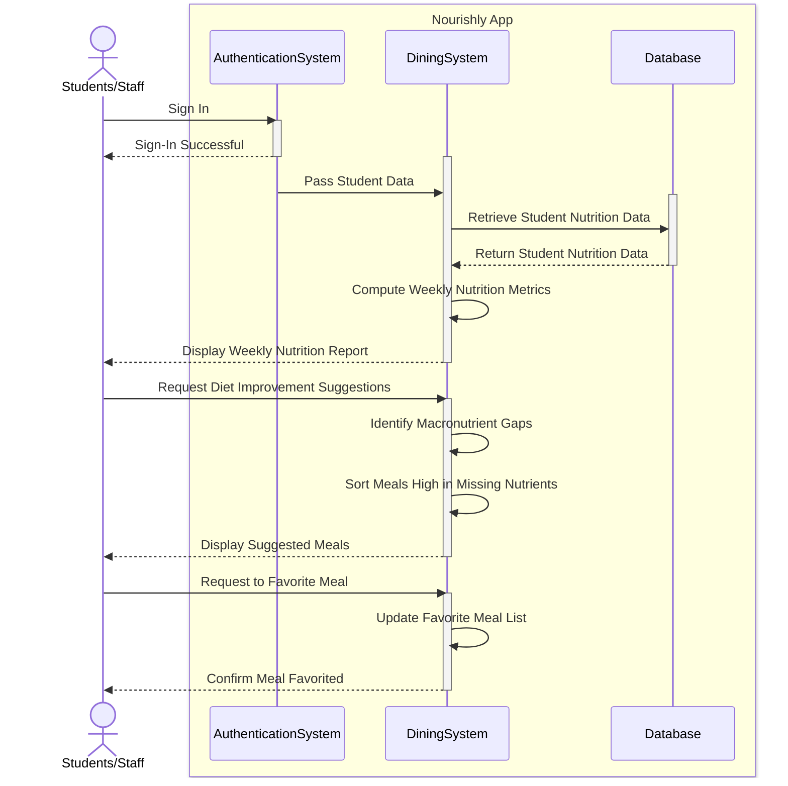

## Sequence Diagram #2: Generating / Displaying Nutrition Report
#### Description: This diagram shows the flow of a user generating their weekly nutrition report, and receiving suggestions to improve their diet.

