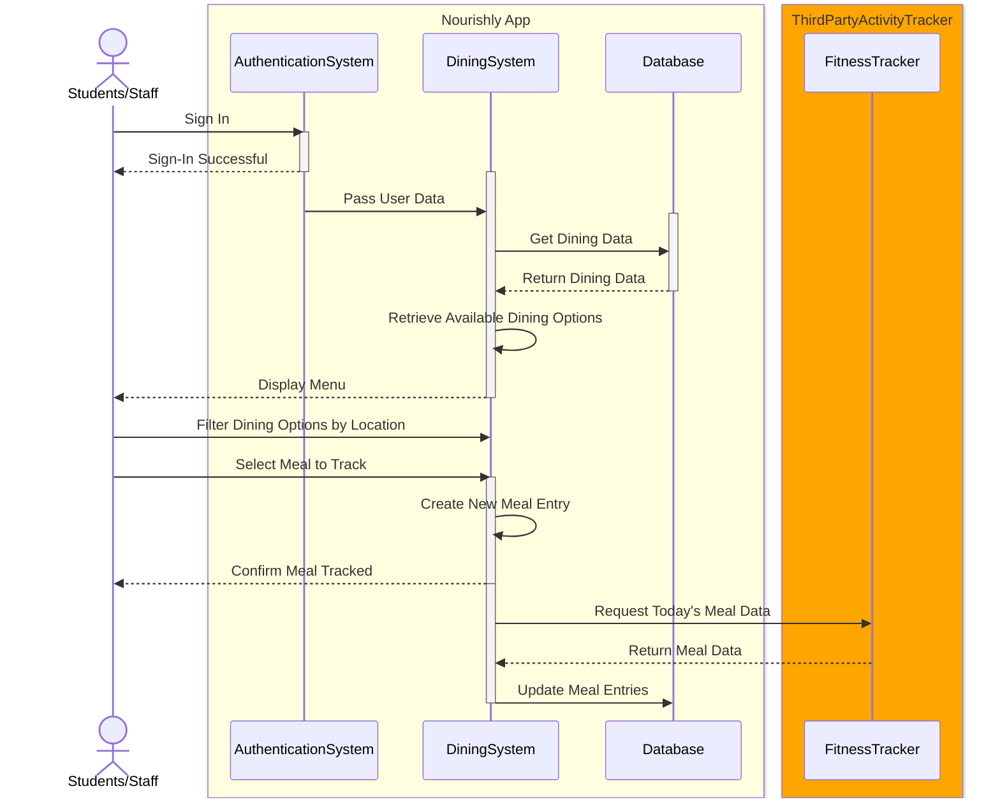

```mermaid
sequenceDiagram
    actor Students/Staff
   
    box lightyellow Nourishly App
    participant AuthenticationSystem
    participant DiningSystem
    participant Database
    end


    box orange ThirdPartyActivityTracker
    participant FitnessTracker
    end


    %% Sign in
    Students/Staff->>AuthenticationSystem: Sign In
    activate AuthenticationSystem
    AuthenticationSystem-->>Students/Staff: Sign-In Successful
    deactivate AuthenticationSystem


    %% Get Dining Data
    activate DiningSystem
    AuthenticationSystem->>DiningSystem: Pass User Data
    activate Database
    DiningSystem->>Database: Get Dining Data
    Database-->>DiningSystem: Return Dining Data
    deactivate Database


    %% Display Menu
    DiningSystem->>DiningSystem: Retrieve Available Dining Options
    DiningSystem-->>Students/Staff: Display Menu
    deactivate DiningSystem


    %% Filter and Select Meal
    Students/Staff->>DiningSystem: Filter Dining Options by Location
    Students/Staff->>DiningSystem: Select Meal to Track


    %% Track Meal
    activate DiningSystem
    DiningSystem->>DiningSystem: Create New Meal Entry
    DiningSystem-->>Students/Staff: Confirm Meal Tracked
    deactivate DiningSystem


    %% Sync with Fitness Tracker
    activate DiningSystem
    DiningSystem->>FitnessTracker: Request Today's Meal Data
    FitnessTracker-->>DiningSystem: Return Meal Data
    DiningSystem->>Database: Update Meal Entries
    deactivate DiningSystem
```
