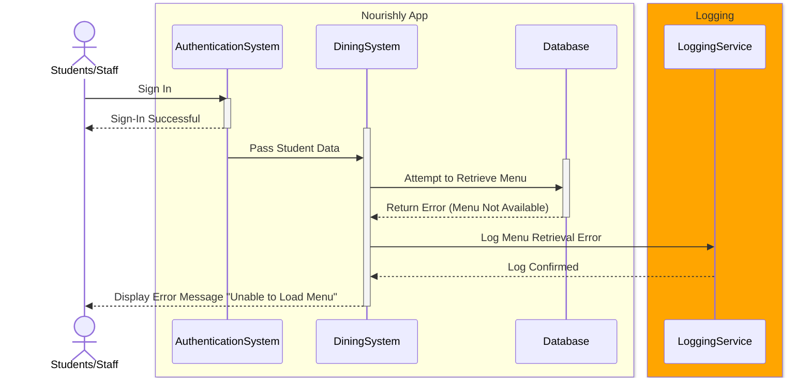

## Sequence Diagram #5: Database Server Error
#### Description: This diagram shows the flow of how the system handles an error when the database server returns an error.

```mermaid
sequenceDiagram
    actor Students/Staff

    box lightyellow Nourishly App
    participant AuthenticationSystem
    participant DiningSystem
    participant Database
    end

    box orange Logging
    participant LoggingService
    end


    %% Sign in
    Students/Staff->>AuthenticationSystem: Sign In
    activate AuthenticationSystem
    AuthenticationSystem-->>Students/Staff: Sign-In Successful
    deactivate AuthenticationSystem


    %% Try to get Dining Data
    activate DiningSystem
    AuthenticationSystem->>DiningSystem: Pass Student Data
    activate Database
    DiningSystem->>Database: Attempt to Retrieve Menu
    Database-->>DiningSystem: Return Error (Menu Not Available)
    deactivate Database


    %% Handle Error (gracefully)
    DiningSystem->>LoggingService: Log Menu Retrieval Error
    LoggingService-->>DiningSystem: Log Confirmed
    DiningSystem-->>Students/Staff: Display Error Message "Unable to Load Menu"
    deactivate DiningSystem
```
