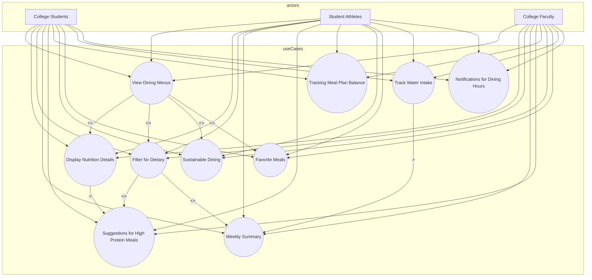

```mermaid
graph TD
  %% Actors
  subgraph actors
      A[College Students]
      B[Student Athletes]
      C[College Faculty]
  end


  %% Use Cases
  subgraph useCases
      U1((View Dining Menus))
      U2((Display Nutrition Details))
      U3((Filter for Dietary))
      U4((Weekly Summary))
      U5((Suggestions for High Protein Meals))
      U6((Tracking Meal Plan Balance))
      U7((Sustainable Dining))
      U8((Favorite Meals))
      U9((Track Water Intake))
      U10((Notifications for Dining Hours))


  end


  %% Actor associations
  A --> U1
  A --> U2
  A --> U3
  A --> U4
  A --> U5
  A --> U6
  A --> U7
  A --> U8
  A --> U9
  A --> U10
  B --> U1
  B --> U2
  B --> U3
  B --> U4
  B --> U5
  B --> U6
  B --> U7
  B --> U8
  B --> U9
  B --> U10
  C --> U1
  C --> U2
  C --> U3
  C --> U4
  C --> U5
  C --> U6
  C --> U7
  C --> U8
  C --> U9
  C --> U10


  %% Use case relationships
  U1 -->|<<include>>| U2
  U1 -->|<<include>>| U3
  U3 -->|<<include>>| U5
  U1 -->|<<include>>| U7
  U3 -->|<<include>>| U4


  U1 -->|<<extend>>| U8
  U2 -->|<extend>>| U5
  U9 -->|<extend>>| U4
```