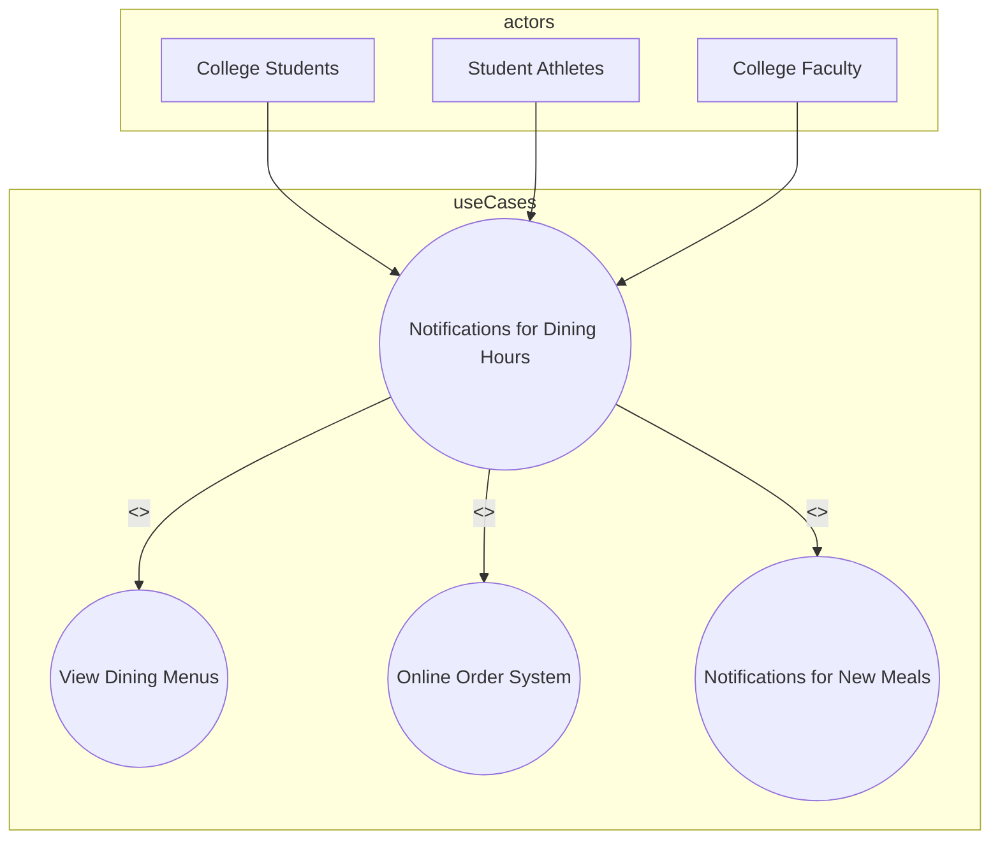

```mermaid
graph TD
  %% Actors
  subgraph actors
      A[College Students]
      B[Student Athletes]
      C[College Faculty]
  end


  %% Use Cases
  subgraph useCases
      U1((Notifications for Dining Hours))
      U2((View Dining Menus))
      U3((Online Order System))
      U4((Notifications for New Meals))


  end


  %% Actor associations
  A --> U1
  B --> U1
  C --> U1


  %% Use case relationships
  U1 -->|<<include>>| U2
  U1 -->|<<extend>>| U3
  U1 -->|<<extend>>| U4
```