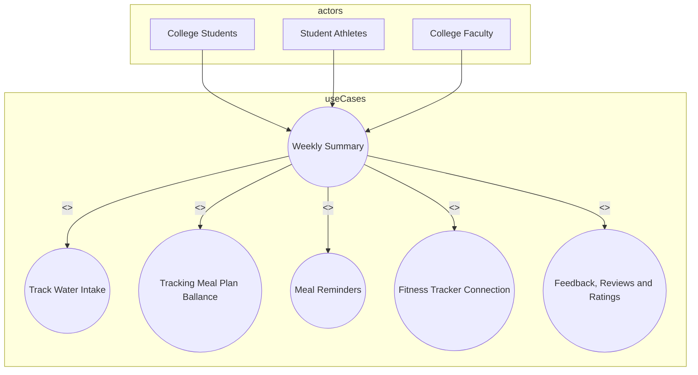

```mermaid
graph TD
  %% Actors
  subgraph actors
      A[College Students]
      B[Student Athletes]
      C[College Faculty]
  end


  %% Use Cases
  subgraph useCases
      U1((Weekly Summary))
      U2((Track Water Intake))
      U3((Tracking Meal Plan Ballance))
      U4((Meal Reminders))
      U5((Fitness Tracker Connection))
      U6((Feedback, Reviews and Ratings))


  end


  %% Actor associations
  A --> U1
  B --> U1
  C --> U1


  %% Use case relationships
  U1 -->|<<include>>| U2
  U1 -->|<<include>>| U3
  U1 -->|<<extend>>| U4
  U1 -->|<<extend>>| U5
  U1 -->|<<extend>>| U6
```