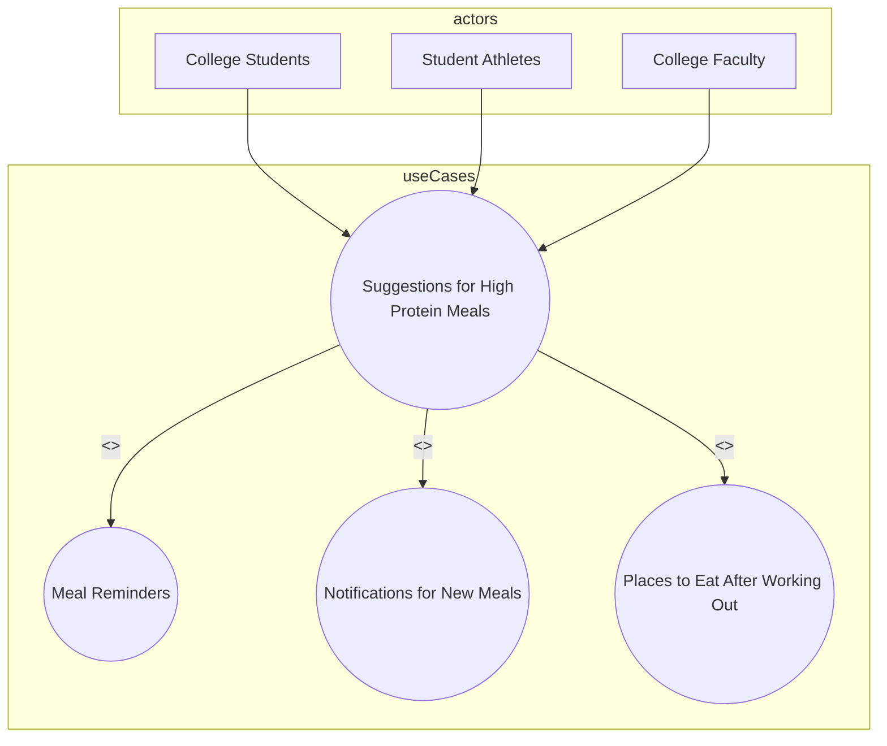

```mermaid
graph TD
  %% Actors
  subgraph actors
      A[College Students]
      B[Student Athletes]
      C[College Faculty]
  end


  %% Use Cases
  subgraph useCases
      U1((Suggestions for High Protein Meals))
      U2((Meal Reminders))
      U3((Notifications for New Meals))
      U4((Places to Eat After Working Out))


  end


  %% Actor associations
  A --> U1
  B --> U1
  C --> U1


  %% Use case relationships
  U1 -->|<<include>>| U2
  U1 -->|<<extend>>| U3
  U1 -->|<<extend>>| U4

```